<p align="center">
  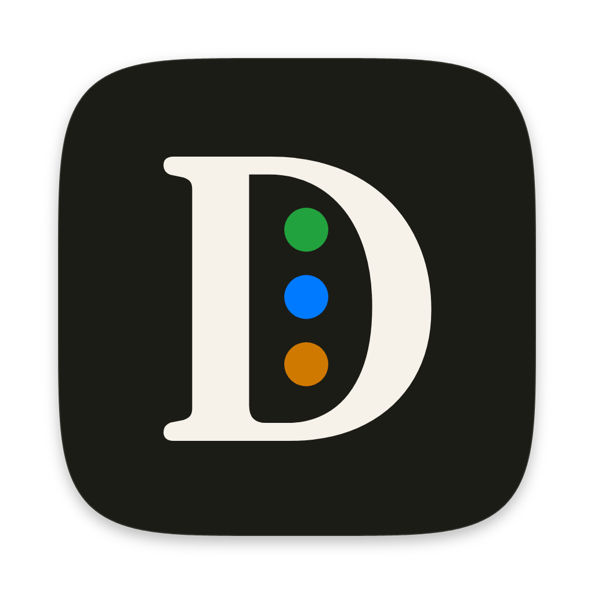
</p>

<h1 align="center">DayBoard</h1>

<p align="center"><strong>Your day, in one place.</strong></p>

<p align="center">
  Google Tasks, Apple Reminders, Gmail, and Google Calendar together on your Mac.
</p>

<p align="center">
  <a href="https://getdayboard.com">Website &amp; waitlist</a> ·
  <a href="#getting-started">Getting started</a> ·
  <a href="#development">Development</a> ·
  <a href="LICENSE">GPL-3.0-only</a>
</p>

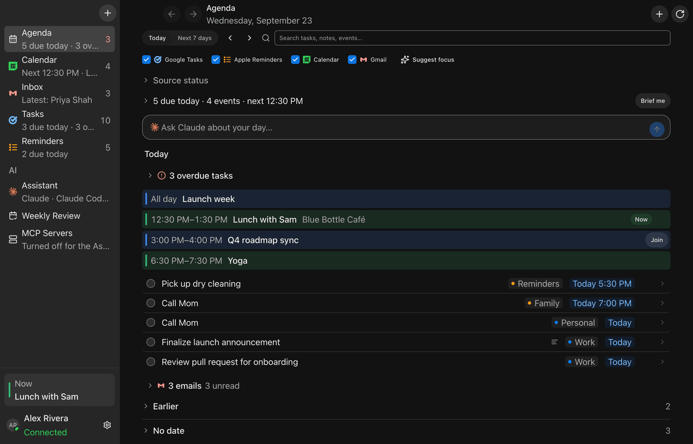

DayBoard brings your tasks, reminders, calendar, and inbox into a standalone macOS app. Plan today,
see the week ahead, and act on your work from one dashboard. An optional AI assistant helps with
briefings, prioritization, capture, and meeting preparation using a provider you choose.

> **Beta preview:** the current source version is **1.3.0-beta.8**, targeting **macOS 14+ on Apple
> Silicon**. Join the waitlist at [getdayboard.com](https://getdayboard.com/waitlist). Preview packages are ad-hoc
> signed and are not notarized. Public downloads and purchases depend on the checks in the
> [release guide](docs/RELEASE.md).

## What you can do

| View or feature              | What it brings together                                                                                                                  |
| ---------------------------- | ---------------------------------------------------------------------------------------------------------------------------------------- |
| **Agenda**                   | Today or the next 7 days of tasks, reminders, and events, with overdue items, search, source filters, and a daily brief.                 |
| **Calendar**                 | Week and month views, plus editing for event titles, descriptions, times, and locations.                                                 |
| **Tasks & Reminders**        | Create, complete, edit, and delete items in their original source. Link duplicates to show them once in the Agenda.                      |
| **Inbox**                    | Recent Gmail, email details, optional AI triage, and reply drafts saved to Gmail.                                                        |
| **Assistant**                | Briefings, prioritization, natural-language capture, meeting prep, and weekly reviews. Search, reopen, and continue saved conversations. |
| **Appearance & preferences** | Light and dark themes, accent and source colors, compact density, three detail layouts, launch view, auto-refresh, and Start at login.   |

## Getting started

The current packaged app requires **an Apple Silicon Mac running macOS 14 or later**.

1. **Join the waitlist** at [getdayboard.com](https://getdayboard.com/waitlist), or
   [build from source](#development).
2. **Connect your sources** in **Settings → Sources**. Sign in with Google for Tasks, Gmail, and
   Calendar; connect Apple Reminders when you are ready to grant its macOS permission.
3. **Choose your AI provider**, if you want AI features. Each AI feature can be turned off.

Google sign-in uses the app's desktop OAuth configuration. People using a configured build do not
need to create a Google Cloud project. Source builds need their own client configuration; see
[Google configuration](#google-configuration).

### How changes and linked items work

DayBoard reads each connected source and writes changes back to that source. Tasks and reminders
remain in their original apps; DayBoard does not copy them between Google Tasks and Apple Reminders.

When item details show a **Possible duplicate**, choose **Link** to combine its Agenda row or
**Dismiss** to keep the items separate.

- Linked items appear once, with their source/list chips and a link icon. DayBoard displays the most
  specific deadline; Google Tasks wins ties.
- Completing a linked group in DayBoard updates its available, incomplete members, including chains
  of links. Source filters only change what is shown. Partial failures are reported, and **Undo**
  restores only changes that succeeded.
- Links are saved locally per Google account and survive restarts, renamed titles, and temporarily
  unavailable partners. **Unlink** removes the association without deleting either source item.
- Changes made outside DayBoard are not mirrored to linked partners. Editing or deleting a linked
  item affects only the selected source item; deletion asks for confirmation.

Recurring Apple Reminders cannot currently be edited or deleted one occurrence at a time. Undo is
unavailable when completing a recurring reminder advances it. Calendar edits and deletions affect
the selected occurrence, never the whole series.

### Optional AI and MCP

AI uses a provider you explicitly select and configure. You can also choose signed-in
[Claude Code](https://claude.com/claude-code) or [Codex CLI](https://github.com/openai/codex)
installations as providers. Provider access and AI usage are separate from an app purchase.

Assistant conversations are saved locally per account, with separate demo history. **New chat** keeps
the previous conversation; **Import Previous Chat** preserves the conversation retained by an older
version.

DayBoard also includes an optional local **MCP server** so compatible clients can use its sources
while the app runs. Enable it in **Settings → MCP Servers**. It is off by default, requires an access
key, and stays read-only unless you explicitly enable changes.

## Screenshots

Every screenshot uses built-in **fictional demo data**. Expand either gallery to explore the views.

<details>
<summary>Light theme — Agenda, Calendar, Tasks, Reminders, Inbox, Assistant, and Settings</summary>

<table>
<tr><td width="50%">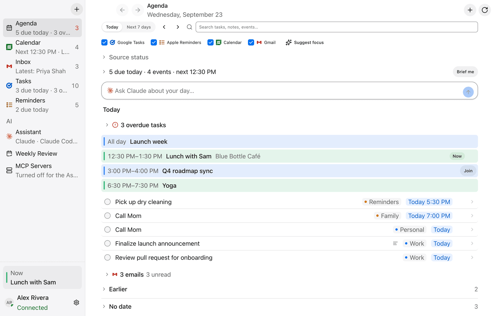<br><sub>Agenda</sub></td><td width="50%">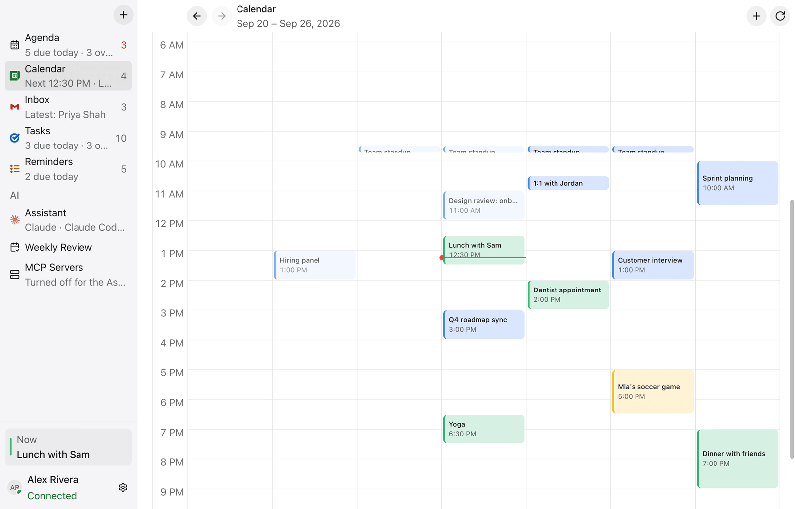<br><sub>Calendar — week</sub></td></tr>
<tr><td width="50%">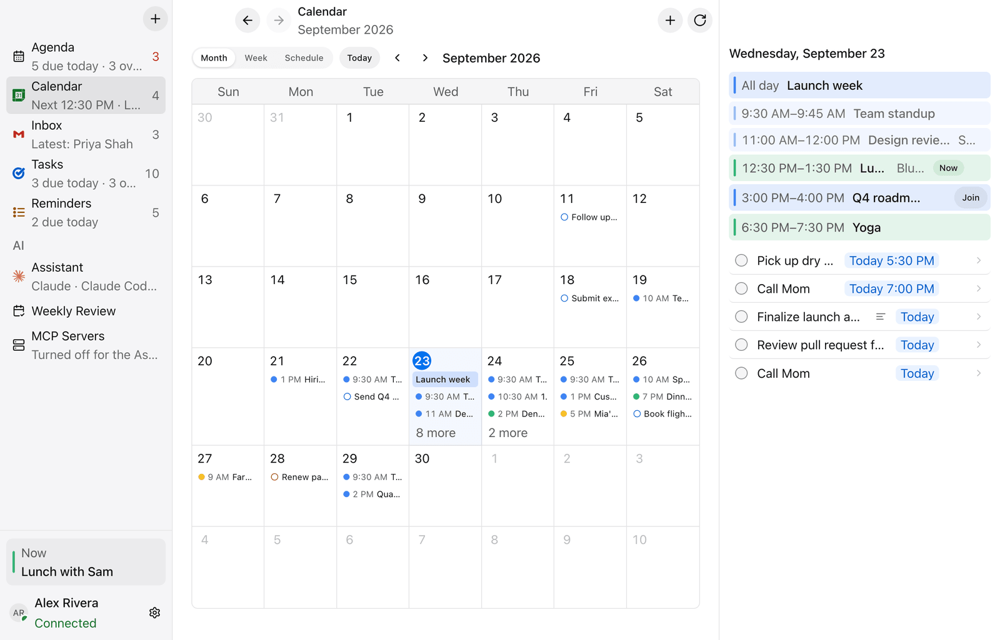<br><sub>Calendar — month</sub></td><td width="50%">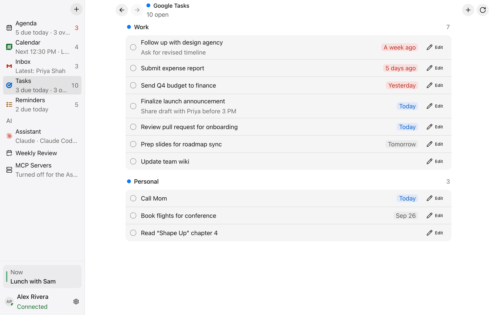<br><sub>Tasks</sub></td></tr>
<tr><td width="50%">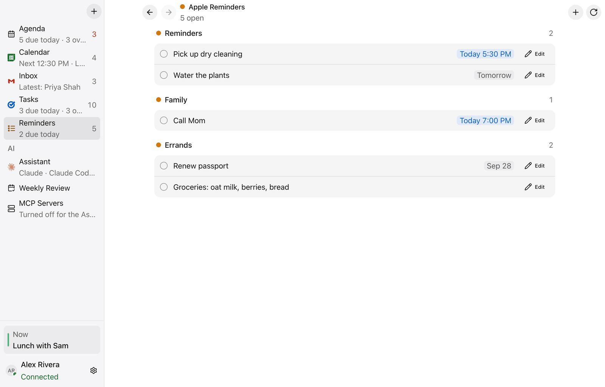<br><sub>Reminders</sub></td><td width="50%">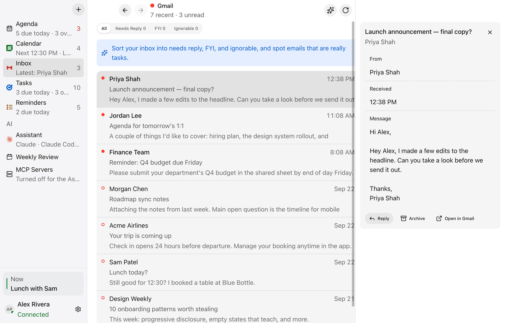<br><sub>Inbox with email details</sub></td></tr>
<tr><td width="50%">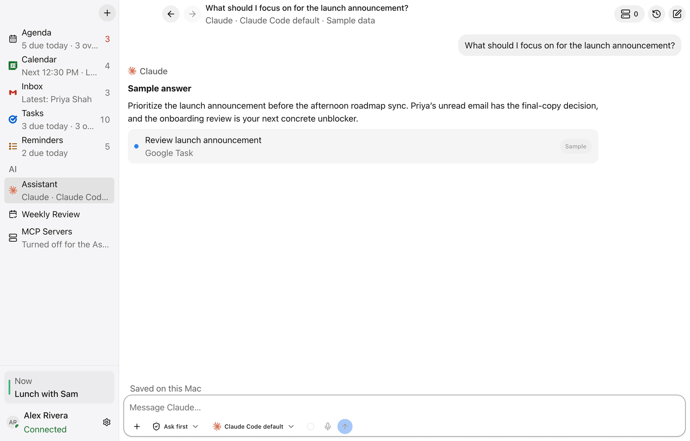<br><sub>Assistant</sub></td><td width="50%">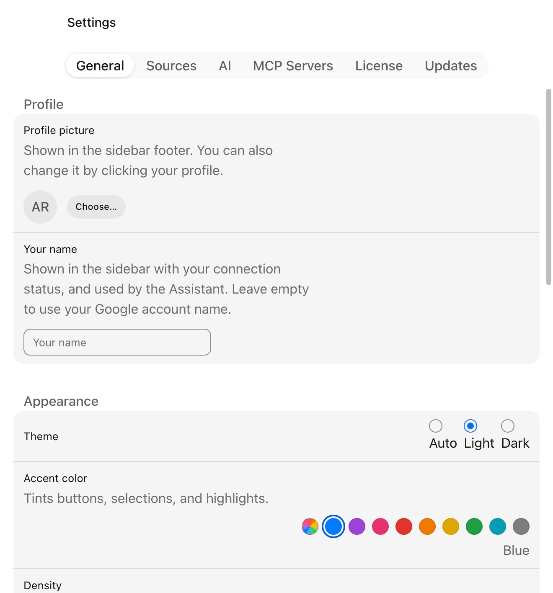<br><sub>Settings</sub></td></tr>
</table>

</details>

<details>
<summary>Dark theme — Agenda, Calendar, Tasks, Reminders, Inbox, Assistant, and Settings</summary>

<table>
<tr><td width="50%"><br><sub>Agenda</sub></td><td width="50%">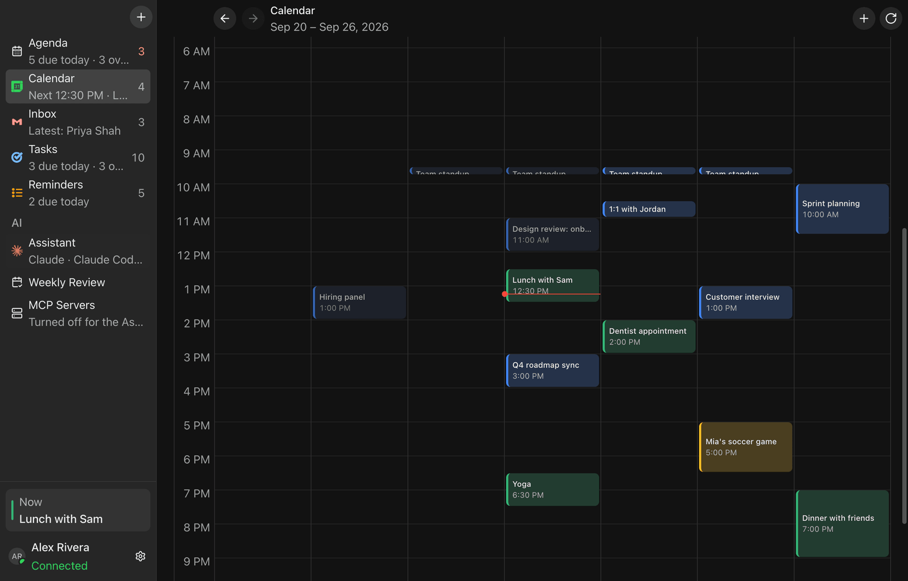<br><sub>Calendar — week</sub></td></tr>
<tr><td width="50%">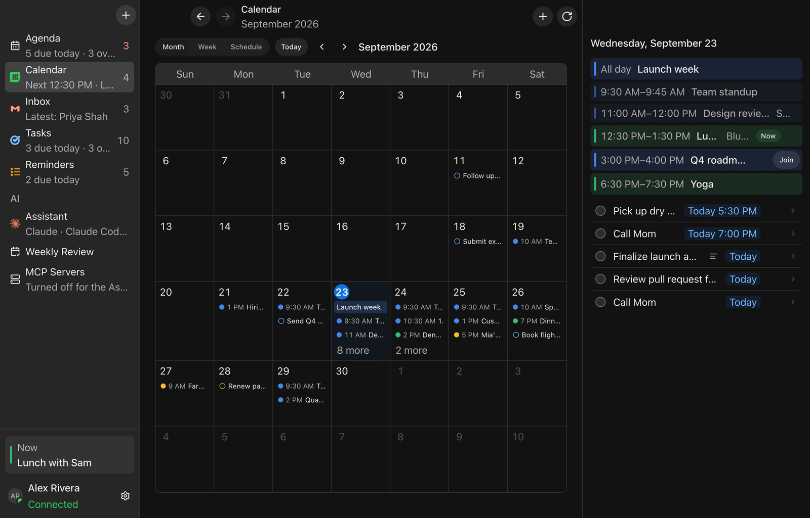<br><sub>Calendar — month</sub></td><td width="50%">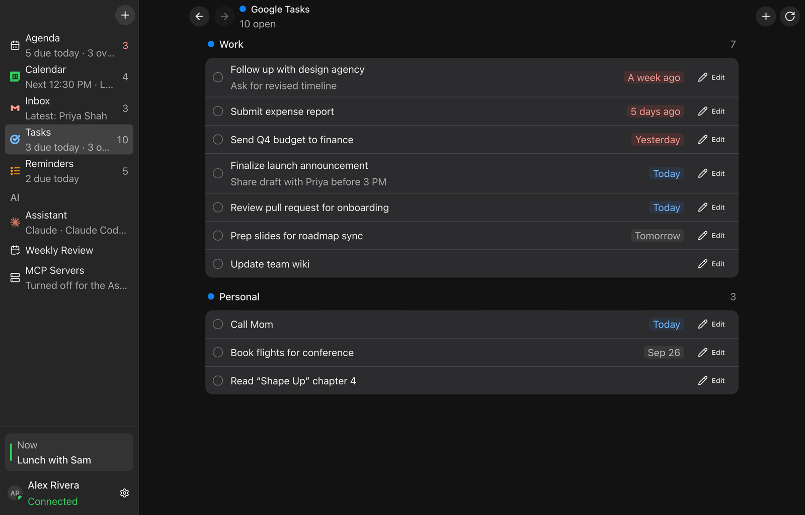<br><sub>Tasks</sub></td></tr>
<tr><td width="50%">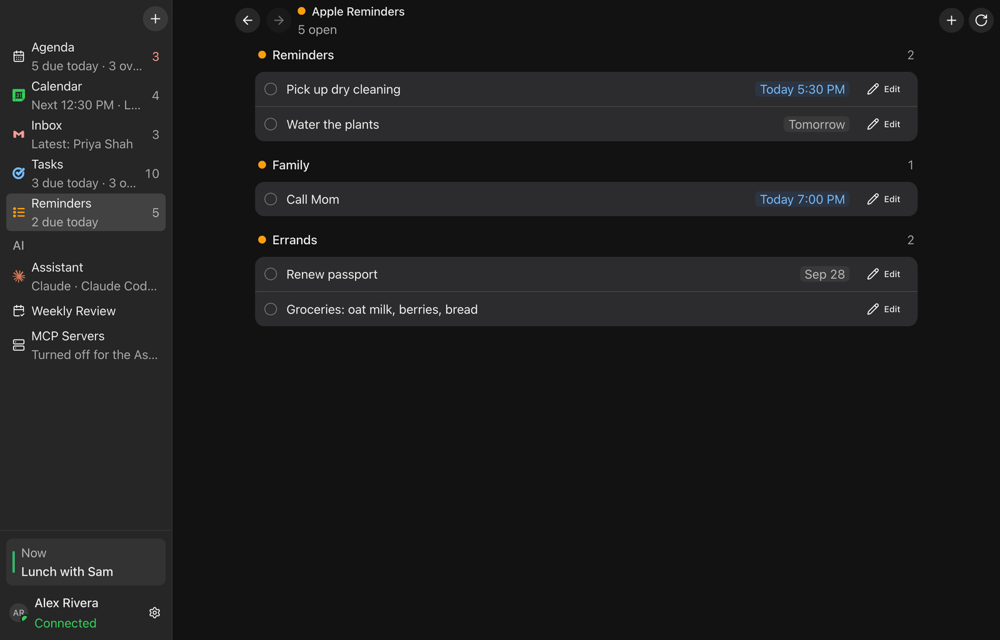<br><sub>Reminders</sub></td><td width="50%">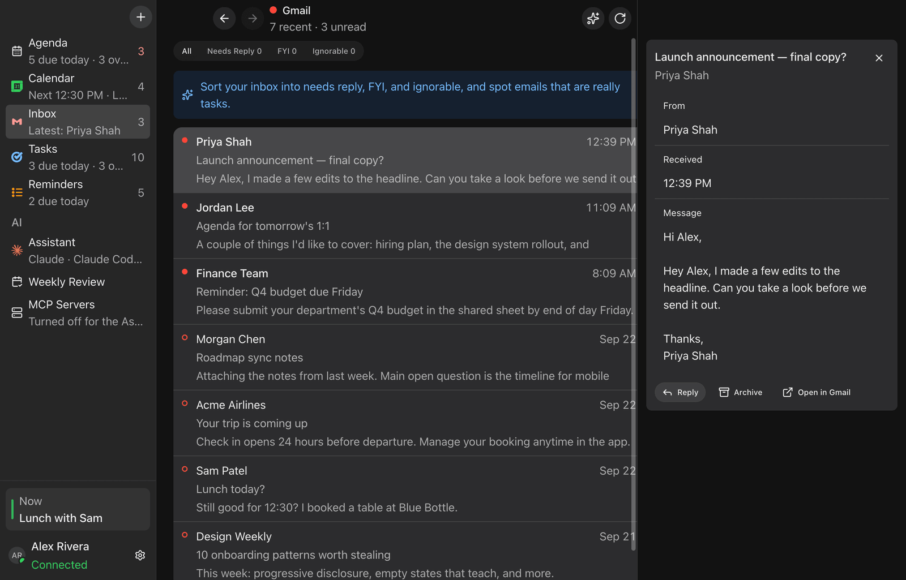<br><sub>Inbox with email details</sub></td></tr>
<tr><td width="50%">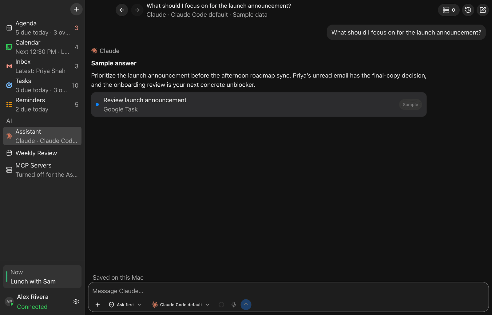<br><sub>Assistant</sub></td><td width="50%">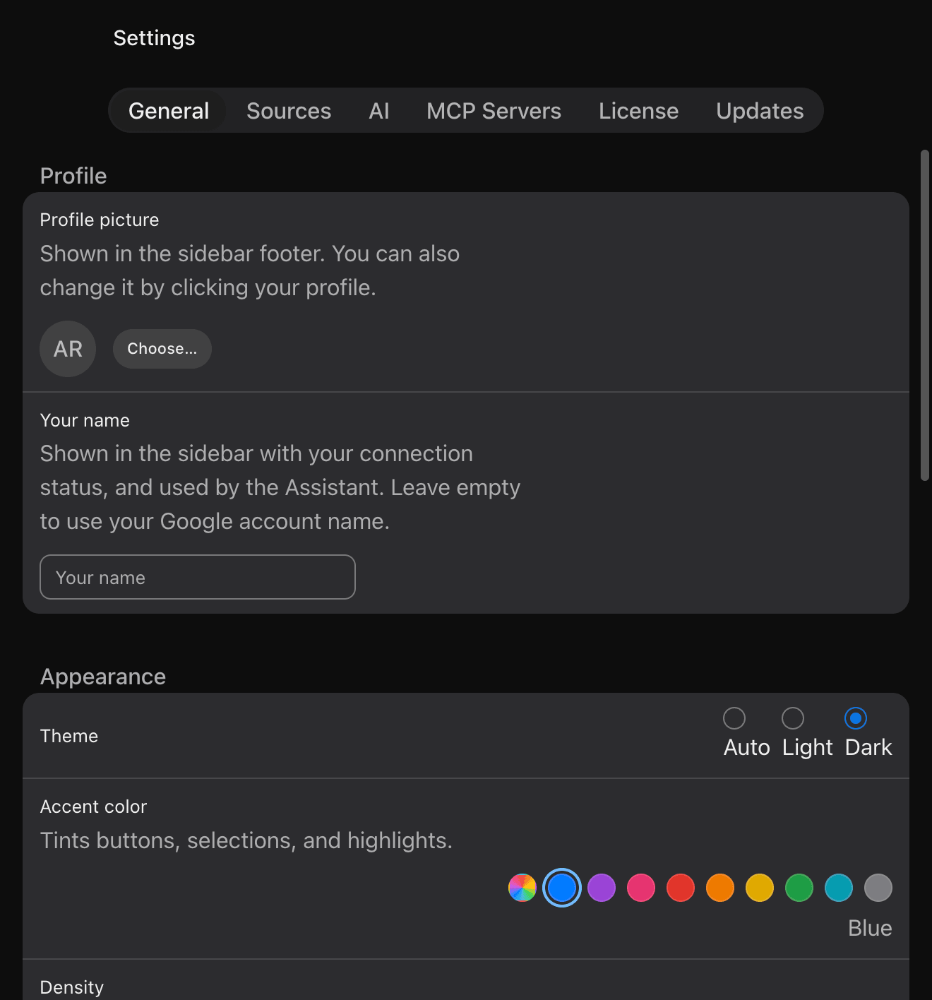<br><sub>Settings</sub></td></tr>
</table>

</details>

## Development

DayBoard is built with **Electron, TypeScript, React, and a Swift EventKit helper**. It runs standalone,
without a Glaze installation. Development requires **Node.js 24+**, macOS, and the **Xcode command line
tools** for the native helper.

```sh
git clone https://github.com/miles-chu10/dayboard.git
cd dayboard
npm ci --include=dev
npm run dev
```

`npm run dev` builds the native Reminders helper, then starts Electron and Vite.

### Google configuration

For Google integration, supply your own **Desktop OAuth client** through
`DAYBOARD_GOOGLE_OAUTH_FILE` or `~/.config/dayboard/google-oauth.json`. Keep the configuration outside
the repository and never commit it. Ordinary builds remain usable without it, with Google sign-in
shown as unavailable; strict release builds reject missing configuration.

See the [release guide](docs/RELEASE.md#required-commercial-configuration) for the configuration
format and build inputs. Apple Reminders uses the bundled Swift helper and requests permission when
you connect that source.

### Commands

| Command                   | Purpose                                                                              |
| ------------------------- | ------------------------------------------------------------------------------------ |
| `npm run dev`             | Start the app with renderer hot reload.                                              |
| `npm run build`           | Compile the native helper, app, and third-party notices.                             |
| `npm test`                | Run offline unit and native fixtures.                                                |
| `npm run format:check`    | Check formatting; use `npm run format` to apply it.                                  |
| `npm run typecheck`       | Check the main/preload and renderer TypeScript projects.                             |
| `npm run lint`            | Run ESLint.                                                                          |
| `npm run test:e2e`        | Build a credential-free app and run isolated Electron tests.                         |
| `npm run screenshots`     | Regenerate both screenshot galleries from a disposable demo profile.                 |
| `npm run package:preview` | Create a local ad-hoc-signed DMG and update ZIP, without notarization or publishing. |

GitHub CI runs formatting, type checking, lint, offline app tests, and separate billing tests on
pull requests and pushes to `main`. Native app and packaged-build checks run on macOS.

### Repository layout

| Path                                                            | Responsibility                                          |
| --------------------------------------------------------------- | ------------------------------------------------------- |
| [`main/`](main/)                                                | Backend services and Electron lifecycle.                |
| [`main/platform/`](main/platform/)                              | Native platform boundaries.                             |
| [`electron/preload.ts`](electron/preload.ts)                    | Sandboxed bridge between the renderer and main process. |
| [`renderer/`](renderer/)                                        | React UI for the dashboard and Settings.                |
| [`native/reminders-helper/`](native/reminders-helper/)          | Swift EventKit integration for Apple Reminders.         |
| [`shared/`](shared/)                                            | Shared types and IPC protocol.                          |
| [`tests/`](tests/) and [`e2e/`](e2e/)                           | Offline fixtures and isolated Electron tests.           |
| [`billing/`](billing/)                                          | Separate Stripe Checkout and license service.           |
| [`website/`](website/) and [`website-worker/`](website-worker/) | Product site, waitlist signup UI, and site hosting.     |
| [`brand/`](brand/)                                              | App icon sources and regeneration instructions.         |

### Demo and test isolation

Automated UI tests use disposable profiles and fictional data. Demo settings, appearance, and chat
history are separate; AI replies are local samples. Live source writes, authentication changes,
licensing changes, external service links, and MCP access are blocked. Editors can be previewed
without saving. Artifacts stay in ignored directories. **Never use a personal profile for automated
UI tests.**

## License and builds

The source is licensed under [GPL-3.0-only](LICENSE). You can build and modify it under that license.
For a community build with the official purchase gate disabled:

```sh
DAYBOARD_LICENSE=off npm run build
```

This setting is embedded at build time; changing a user's runtime environment does not change it.
Strict official-release packaging rejects community mode.

Configured official builds include a **14-day trial**, license activation in Settings, and a
**30-day offline validation grace period**. Data viewing, preferences, and account recovery remain
available when a license blocks editing and AI. Demo and unconfigured preview builds do not open
the personal license store or make licensing requests. **AI usage is not included in an app
purchase.**

Payments use Stripe-hosted Checkout and the separate service in [`billing/`](billing/). Customers
retrieve a DayBoard key from the authenticated receipt page and activate it in Settings. Stripe and
webhook secrets remain in the backend; the app embeds only public service/product configuration.

`npm run dist` requires complete Google and live license-service configuration and does not publish.
Developer ID signing, notarization, merchant verification, and update installation must pass the
[release gates](docs/RELEASE.md#verification-gates) before public distribution.

## Project documentation

- [Release guide](docs/RELEASE.md) — build modes, configuration, signing, updates, and verification.
- [Automated releases](docs/AUTOMATED_RELEASES.md) — release workflow setup.
- [Project plan](docs/EXECPLAN.md) and [handoff](HANDOFF.md) — implementation status and remaining work.
- [GitHub workflows](docs/github-workflows.md) — CI and optional review automation.
- [Prompt caching](docs/PROMPT-CACHING.md) — provider-specific behavior and usage reporting.
- [Brand assets](brand/README.md) — icon sources and export instructions.

For bugs or feature requests, [open an issue](https://github.com/miles-chu10/dayboard/issues).
Include the DayBoard version, macOS version, and steps to reproduce; leave out credentials and
personal task, calendar, or email content.
